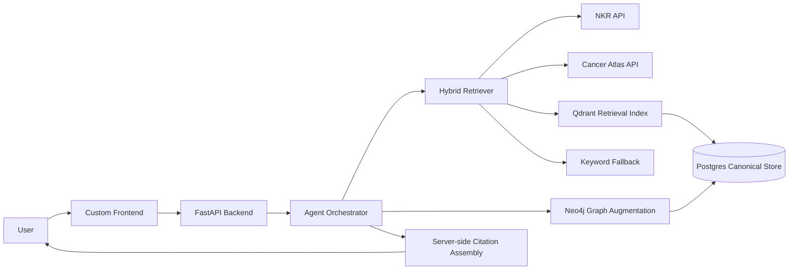

# KankerWijzer

## Medical-Grade Cancer RAG for Trusted Dutch Oncology Information

## One-Line Pitch
KankerWijzer is a provenance-first cancer information assistant that connects trusted Dutch oncology sources and answers questions with exact citations, safe refusal behavior, and patient-friendly guidance.

## The Problem We Are Solving

Today, Dutch cancer information is trusted but fragmented.

- Patients and families use general AI because it is fast and easy.
- Trusted cancer information is spread across multiple IKNL-related websites, APIs, reports, and guideline pages.
- Users must know where to search, how to interpret the results, and how to compare different source types.
- Generic AI can sound confident while being wrong, incomplete, or uncited.

This creates three practical failures:

1. People get answers fast, but not reliably.
2. Trusted sources exist, but are hard to navigate.
3. Medical information loses context when it is separated from its source.

## What KankerWijzer Solves

KankerWijzer turns scattered trusted sources into one medically careful experience.

- Ask one question and search across multiple trusted sources at once.
- Use structured APIs first when exact numbers matter.
- Use document retrieval for patient information, reports, publications, and guidelines.
- Show every answer with clickable source links.
- Refuse or redirect when evidence is weak, conflicting, or clinically unsafe.

## Who It Is For

### Primary audience
- Dutch-speaking cancer patients and their families

### Secondary audiences
- Healthcare professionals
- Policymakers and researchers

## The Sources We Connect

KankerWijzer connects the source families listed in the hackathon repository:

1. `kanker.nl`
2. `iknl.nl`
3. `nkr-cijfers.iknl.nl`
4. `kankeratlas.iknl.nl`
5. `richtlijnendatabase.nl`
6. IKNL reports
7. Scientific publications

## What Makes This Different from Generic Chatbots

Generic chatbots optimize for fluency.
KankerWijzer optimizes for traceability and safe use.

- Provenance is first-class, not an afterthought.
- Structured data beats embeddings when exactness matters.
- The model does not invent citation URLs.
- The graph is augmentation only, never the sole basis for an answer.
- Unsafe or personalized clinical questions are refused or redirected.

## What “Medical-Grade” Means in This Project

For this hackathon, “medical-grade” means:

- only approved source families are allowed into evidence
- every retrieved chunk preserves exact provenance
- structured sources are preferred for statistics and regional data
- the system abstains when evidence is weak or missing
- the system flags conflicting evidence instead of smoothing it over
- red-flag symptoms and treatment-decision questions trigger safe routing
- distress-screening data is handled as sensitive and kept session-scoped

This is not a diagnostic system.
It is a medically careful information and navigation system.

## Core Product Capabilities

### 1. Source-grounded chat
- Users ask natural-language questions.
- The system retrieves evidence from trusted sources.
- The answer includes structured citations with clickable links.

### 2. Exact statistics and regional insights
- NKR API answers statistics-first questions.
- Cancer Atlas API answers postcode and regional variation questions.
- These sources are used before semantic retrieval.

### 3. Cross-source synthesis
- Patient-friendly pages, professional content, guidelines, reports, and publications can be connected in one answer.
- The answer explains context, not just isolated facts.

### 4. Safe refusal and escalation
- Personalized diagnosis questions are refused.
- Treatment decision questions are redirected to the treating clinician.
- Emergency symptom patterns route to urgent help messaging.

### 5. Lastmeter integration
- A distress thermometer helps users reflect on physical, emotional, practical, social, and spiritual burden.
- Results stay client-side.
- The backend only returns relevant support resources.

## High-Level Architecture

## Storage Ownership Rules

### Postgres is canonical
Postgres owns:
- documents
- chunks
- provenance
- embeddings
- evaluation runs
- feedback

### Qdrant is a projection
Qdrant is only a read-optimized retrieval index.
It can always be rebuilt from Postgres.

### Neo4j is augmentation
Neo4j adds relationship context.
It never answers alone.

## Design Decisions That Make the System Defensible

### Full provenance is preserved
Every chunk keeps:
- canonical URL
- document ID
- chunk ID
- page number when available
- section
- checksum
- fetch time

### Citations are assembled server-side
- The agent may refer to evidence using `[SRC-N]`.
- The server maps those references to real `Provenance` objects.
- The model never authors the final citation URLs.

### APIs are used before embeddings
- Statistics questions go to `nkr-cijfers`.
- Geographic questions go to `kankeratlas`.
- Embeddings are for unstructured content, not for replacing exact source APIs.

### PDF handling is quality-first
- Docling is the primary parser.
- PyMuPDF is fallback only.
- A PDF provenance manifest maps bundled files to exact public landing pages when possible.

### Crawl ingestion is quality-gated
- Firecrawl is required for crawl ingestion.
- Generic HTML fallback is not allowed to poison the canonical index.
- Boilerplate-heavy pages are rejected before ingestion.

## Policy on Richtlijnendatabase

The hackathon repository includes `richtlijnendatabase.nl` as an allowed source, but it is not maintained by IKNL.

KankerWijzer therefore:
- includes it because it is part of the provided source list
- tags it with publisher `Federatie Medisch Specialisten`
- explicitly notes that the guideline is not authored by IKNL

## What We Already Have

The current scaffold already includes:

- FastAPI backend with source endpoints and agent endpoints
- source verification for all listed source families
- local `kanker.nl` dataset access
- live NKR and Cancer Atlas API clients
- Firecrawl-based crawl connectors
- Docling-based PDF parser hook
- provenance-aware response models
- initial refusal behavior
- source verification report

## What This Plan Adds

### Retrieval quality
- embeddings
- Qdrant
- hybrid structured-first retrieval
- calibrated abstention thresholds

### Safety hardening
- conflict detection
- red-flag routing
- source whitelist enforcement
- stronger refusal behavior

### Better product experience
- custom frontend
- Lastmeter flow
- feedback collection
- audience-aware presentation

### Better reasoning support
- Neo4j graph augmentation
- cross-source evidence synthesis

### Better proof of quality
- expanded 45-question evaluation set
- faithfulness checks
- citation correctness checks
- refusal accuracy checks
- hard-fail evaluation gates

## User Experience in One Flow

### Example patient journey
1. A user asks: “Wat is borstkanker?”
2. KankerWijzer searches `kanker.nl` and other relevant trusted sources.
3. It answers in plain Dutch.
4. It shows clickable sources below the answer.
5. If the user asks a treatment-decision question, the system declines and redirects safely.
6. If the user wants support, Lastmeter helps surface the right resource areas.

## How We Reduce Hallucination Risk

- source whitelist only
- structured-first routing
- evidence thresholds
- conflict detection
- server-side citations
- graph augmentation only
- explicit refusal on uncertainty

## How We Map to the Hackathon Criteria

### Domain 1: Information integrity / correctness
- Provides answers from retrieved evidence
- Shows source provenance and reliability
- Uses trusted source families only
- Avoids inventing unsupported medical information
- Declines when accuracy is not possible

### Domain 2: Usability
- Gives users one search experience instead of seven disconnected destinations
- Supports patient-first chat as a natural access pattern
- Reduces clicks and improves source navigation

### Domain 3: Ethics
- Refuses unsafe personalized clinical advice
- Routes emergency and urgent questions appropriately

### Domain 4: Advanced solution
- Connects the provided source ecosystem
- Adds context using graph augmentation and cross-source synthesis
- Built for future IKNL adoption with canonical storage, evaluation pipelines, and deployment paths

### Bonus
- Collects structured user feedback on missing or unclear information

## Why This Is Strong for the Hackathon

KankerWijzer is not just “a chatbot.”

It is a trust-preserving interface layer for oncology knowledge:

- faster than navigating multiple sites manually
- safer than generic AI
- more transparent than simple RAG demos
- more extensible than a one-off prototype

## Planned Delivery Sequence

1. Infrastructure
2. Provenance-preserving ingestion
3. Qdrant projection
4. Hybrid retrieval
5. Safety hardening
6. Tool-using agent
7. Frontend
8. Lastmeter
9. Graph augmentation
10. Crawl expansion
11. Feedback
12. Full evaluation
13. Demo-ready packaging

## Final Message

KankerWijzer solves a simple but important problem:

People already use AI for cancer information.
The question is whether they get speed at the cost of trust.

Our answer is no.

KankerWijzer gives users the speed of AI with the discipline of trusted oncology sources, explicit provenance, and medical-grade refusal behavior.
