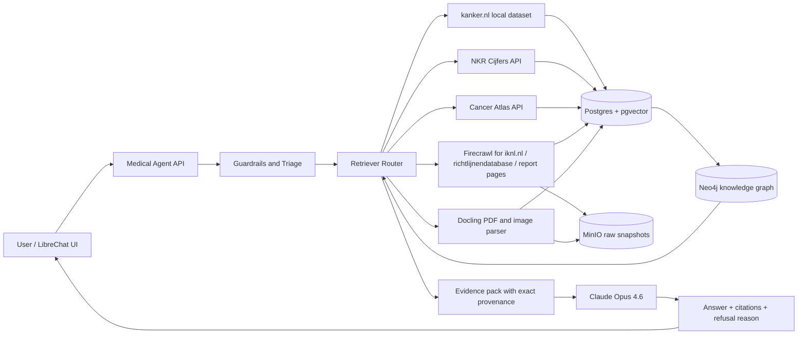

# Uncloud Medical GraphRAG

## Team
- Team: Uncloud
- Focus: provenance-first, medical-grade cancer information assistant for the IKNL hackathon
- Presentation overview: [`PRESENTATION.md`](./PRESENTATION.md)

## Problem
Trusted cancer information is spread across patient pages, registry statistics, regional atlas data, guideline pages, reports, and publications. Users get speed from general AI tools, but not reliable provenance. IKNL's brief makes the bar explicit: trusted sources only, clear citations, refusal on unsupported questions, and no distortion of medical information.

## Proposal
Build a provenance-first `GraphRAG + agent` backend that connects the provided IKNL sources, produces answer-time citations with exact source links, and refuses when evidence is missing or the question becomes personalized medical advice.

This submission includes:
- source adapters for every source described in the hackathon repo
- a FastAPI backend scaffold
- a local-first retrieval layer over the bundled `kanker.nl` crawl
- Firecrawl adapters for scrape-only web sources
- Docling-based PDF/image parsing hooks
- storage schemas for Postgres and Neo4j
- an Anthropic `Claude Opus 4.6` orchestration scaffold
- an evaluation harness with golden questions

## Chosen Stack

| Layer | Choice | Why |
|--|--|--|
| LLM orchestration | Anthropic `claude-opus-4-6` | Current flagship Anthropic model for complex agentic work and 1M context support |
| Crawl/scrape | Firecrawl API | Best fit for controlled crawling of public sites with clean markdown/json output |
| PDF and image parsing | Docling primary, Marker fallback | Docling is MIT, local, OCR-capable, and strong on PDFs/images/tables. Marker is a strong fallback for difficult PDFs |
| GraphRAG | Neo4j + `neo4j-graphrag` | More production-oriented than the Microsoft demo package, and supports Anthropic as an optional provider |
| System of record | Postgres + pgvector | Auditable provenance, chunk metadata, evaluation logs, feedback, and deterministic joins |
| Raw asset storage | MinIO/S3 | Immutable HTML/PDF/image snapshots and replayability |
| UI shell | LibreChat | Better fit for Anthropic, agents, and future MCP/tooling integration |

## Why These Choices

### Crawl and scrape
- Firecrawl's current docs describe `scrape`, `crawl`, and `map`, with markdown/html/json outputs and support for dynamic sites, PDFs, and images.
- For `kanker.nl`, the repo already contains a controlled crawl, so the backend uses the bundled dataset first and treats live crawling as a fallback only.

### PDF and image extraction
- Docling's README explicitly calls out advanced PDF understanding, OCR for scanned PDFs and images, chart understanding, markdown/json export, and local execution.
- Marker remains a useful fallback for difficult PDFs, especially when table fidelity matters, but its GPL/commercial constraints make it a secondary option for a clean hackathon demo.

### GraphRAG
- The Microsoft GraphRAG repo itself describes the package as a methodology and demo code, warns that indexing can be expensive, and notes that it is not an officially supported Microsoft offering.
- Neo4j's official `neo4j-graphrag-python` package is first-party, supports Anthropic as an optional provider, and includes graph construction from text and PDFs plus vector and hybrid retrieval patterns.

### Answer-time citations
- Anthropic's current citations docs recommend passing retrieved chunks as documents or custom content for reliable citations.
- For this scaffold, the backend stores chunk-level provenance so the answerer can always render clickable links even before native Anthropic document citations are wired all the way through.

## Architecture



## Storage Model

### 1. Postgres is the source of truth
Store:
- source catalog and trust tier
- document versions with checksums
- chunk text
- citation spans and offsets
- page numbers, section headers, figure references
- ingestion logs
- evaluation runs
- user feedback

### 2. Neo4j is the reasoning layer
Store:
- cancer types
- symptoms
- treatments
- stages
- tumor groups
- audiences
- regions
- guidelines
- source documents
- chunk-to-entity relations

### 3. Object storage keeps immutable evidence
Store:
- crawled HTML snapshots
- PDFs
- extracted images
- OCR intermediates
- sample outputs used for demo reproducibility

## Source-by-Source Plan

| Source | Access mode | Implemented here |
|--|--|--|
| `kanker.nl` | bundled controlled crawl, live crawl fallback | local dataset adapter and search API |
| `iknl.nl` | Firecrawl scrape/crawl | Firecrawl-backed adapter |
| `nkr-cijfers.iknl.nl` | public JSON API | live API client |
| `kankeratlas.iknl.nl` | public JSON services | live API client |
| `richtlijnendatabase.nl` | controlled crawl/scrape | Firecrawl-backed adapter |
| IKNL reports pages | Firecrawl scrape | Firecrawl-backed adapter |
| bundled IKNL reports PDFs | Docling parser | local PDF parser hook |
| bundled scientific publications PDFs | Docling parser | local PDF parser hook |

## Medical-Grade Guardrails
- Only approved sources are allowed into evidence.
- Every evidence chunk carries `source_id`, `title`, `url`, `excerpt`, and optional `page_number`.
- The answerer should refuse if:
  - there is no adequate evidence
  - the user asks for diagnosis, prognosis, or treatment instructions for a personal case
  - citations cannot be attached
  - evidence conflicts and the system cannot reconcile it safely
- Patient-facing answers should explicitly say they are informational and not a substitute for a clinician.

## Evaluation
The evaluation harness is split into two layers:

### Deterministic checks
- source whitelist compliance
- minimum citation count
- exact source-family hit rate
- refusal behavior on unsafe prompts

### Model-assisted checks
- groundedness against retrieved evidence
- completeness for registry and guideline questions
- citation correctness
- tone and audience fit

Golden questions live in [`backend/eval/golden_questions.yaml`](./backend/eval/golden_questions.yaml).

## Run

### Backend only
```bash
cd teams/uncloud-medical-grade-rag/backend
uv sync
uv run uvicorn app.main:app --reload
```

### Bring up Neo4j
```bash
cd teams/uncloud-medical-grade-rag
docker compose up neo4j
```

### Fetch example outputs
```bash
cd teams/uncloud-medical-grade-rag/backend
uv run python scripts/fetch_source_examples.py
```

### Run retrieval evaluation
```bash
cd teams/uncloud-medical-grade-rag/backend
uv run python scripts/run_eval.py
```

## UI Recommendation
Use LibreChat as the shell UI and point it at this backend. I did not commit a full UI fork into the hackathon repo because that would overwhelm the submission, but the backend is shaped so you can front it with LibreChat immediately.
A shallow local clone is available at `teams/uncloud-medical-grade-rag/vendor/LibreChat` in this workspace.

## External References
- Firecrawl docs: https://docs.firecrawl.dev/api-reference/introduction
- Firecrawl Python SDK: https://docs.firecrawl.dev/sdks/python
- Docling: https://github.com/docling-project/docling
- Marker: https://github.com/datalab-to/marker
- Neo4j GraphRAG: https://github.com/neo4j/neo4j-graphrag-python
- Microsoft GraphRAG: https://github.com/microsoft/graphrag
- Anthropic models overview: https://platform.claude.com/docs/en/docs/models-overview
- Anthropic citations: https://platform.claude.com/docs/en/build-with-claude/citations
- Anthropic files API: https://platform.claude.com/docs/en/build-with-claude/files
